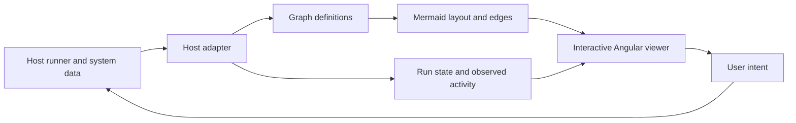

# Direction and open questions

Date: 2026-10-05. Status: Proposed; no new public API or architecture decision accepted yet.

Related: [Context](01_context-and-use-cases.md), [baseline](02_repository-baseline.md), [plan index](../plans/00_index.md).

## Initial recommendation

**Sequence update:** after the initial recommendation below, the user requested realistic demos to evaluate grouping, colours, right-click inspection, navigation, and responsiveness. [The demo plan](../plans/03_work-style-demos.md) now comes first. Rich node content remains a proposal pending that feedback.

Keep Mermaid responsible for graph layout and connection geometry. Investigate an Angular-owned layer for node controls and previews, with the host supplying configuration and observed activity. Preserve the existing simple viewer for consumers that do not need rich nodes.

This targets the interaction gap without turning the library into a work-specific execution engine. It also gives the local AI system the same generic controls, evidence, progress, and activity primitives.

Arrows from the viewer represent requests. The host validates and acknowledges them before presenting an execution or configuration change as applied.

## Can a node contain an Angular Material checkbox?

Yes, this is a plausible library extension, but it is not exposed today. Putting `<mat-checkbox>` into Mermaid label text would not create an Angular-managed component. Angular provides component/template rendering mechanisms such as `NgComponentOutlet` and `ViewContainerRef`; the prototype must use a real Angular view with managed bindings and cleanup. See [Angular programmatic rendering](https://angular.dev/guide/components/programmatic-rendering).

Candidate approaches:

| Approach | Benefit | Cost / question |
| --- | --- | --- |
| Angular content positioned over reserved node space in the camera scene | Angular owns lifecycle and input handling; SVG remains Mermaid-owned | Must expose reliable node bounds, align transforms, and reserve space before layout |
| Angular views mounted into reserved label/`foreignObject` containers | Content sits directly inside the measured node | Must survive Mermaid DOM replacement, SVG/HTML boundaries, cleanup, and Material overlay behavior |
| Inspector/popover editing first | Uses the existing canvas/detail seam with less layout work | Does not establish whether inline interaction closes the LiteGraph gap |

**Proposed first experiment:** a fixed-footprint, scene-aligned Angular node body. Compare with the existing reserved-label approach if alignment or sizing is awkward. Do not publish a generic renderer API until a checkbox, text input, and bounded preview work through rerenders and navigation.

Mermaid supports HTML labels and explicit edge IDs/animation in its flowchart syntax. These are useful building blocks, not an Angular widget runtime or an instrumentation source. See [Mermaid flowcharts](https://mermaid.js.org/syntax/flowchart.html) and [configuration/security levels](https://mermaid.js.org/config/usage.html). Verify behavior against this repository's resolved version during the spike.

## Proposed boundaries

| Library | Host runner / application |
| --- | --- |
| Layout, camera, selection, drill-down, visible node content | Execute CLI, Playwright, SQL, Kafka, and API operations |
| Display state, activity, evidence, and pending user intent | Validate configuration, environment eligibility, and action permissions |
| Generic node-content/action extension contracts | Define parameter schemas and domain-specific editors |
| Render observed traffic and replay evidence | Collect/correlate events; retain authoritative history |
| Highlight profile membership and readiness supplied by host | Resolve profiles and provision required services |

Skipping a flush step in the UI must reflect runner enforcement. A shared-dev reset must remain rejected by the runner even if requested without the UI. Headed/headless is runner configuration; a semi-live preview is a separate host capability and need not imply headed execution.

## Design principles to validate

- Separate stable graph definitions, execution snapshots, transient activity, and user view state. A telemetry tick or frame update should not trigger Mermaid layout.
- Give step instances, attempts, graph paths, resources, and relations unambiguous identities. Repeated subflows and parallel edges must not collapse together.
- Show the difference between planned relationships, inferred execution feedback, and observed traffic. No data means unknown/stale, not healthy or idle by default.
- Keep control-flow edges separate from system relationships such as calls, publishes, consumes, reads, writes, and requires. Link views through shared host identities.
- Start with a feature-scoped graph and drill into services/endpoints/tables. Do not assume hundreds of repositories will be useful or performant as one fully expanded canvas.
- Keep the current public model compatible while experimenting with richer host adapters. A renderer-independent core is a later decision, not a prerequisite.

## Open questions for the next discussion

| Question | Why it changes the plan |
| --- | --- |
| Which demo interactions feel worse than LiteGraph? | User highlighted grouping, colours, right-click details, and navigation; realistic demos will narrow this down |
| Is visual workflow authoring needed, or primarily configuration and run inspection? | Dragging connections, adding nodes, and persistence are a separate scope |
| What anonymized step/profile/run-event examples can describe the host contract? | Avoids inventing a schema the existing runner cannot supply |
| What telemetry exists today, and which calls happen beyond the CLI's visibility? | Sets the honest boundary for the first activity demo |
| What are typical visible node counts, concurrent steps, and event rates? | Sets measurable performance targets |
| When can parameters change: before run, before step, or during execution? | Determines draft/applied state and validation semantics |
| Which environment/feature view would be useful first? | Keeps the dependency graph focused |

Until clarified, the plans assume run configuration/inspection first, synthetic local fixtures, parameters locked once the run starts, and feature-scoped system views. These are planning assumptions, not user decisions.
